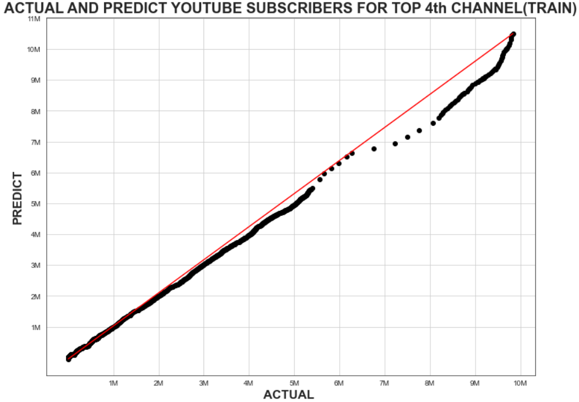
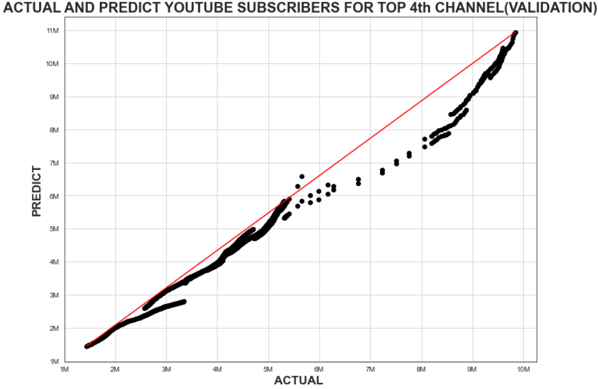

##  GET Sponsored

The goal of this project is to find out the most subscribed YouTube channel to sponsor it, to support our company's products.

To reach this goal, we investigated the data that we scripted from SocialBlade for the best channels in terms of views and subscriptions in Saudi Arabia, and through this data and after analyzing it, we identified TOP5 YouTube channels, 

and through this data we were able to predict the number of views and choose Top 4 for example, to find out the R squared for train and Validation ,and plot the actual and predict youtube subscribers for top 4th channel as shown in the chart below 

* R squared for train : 0.999845

* R squared for val : 0.981944

